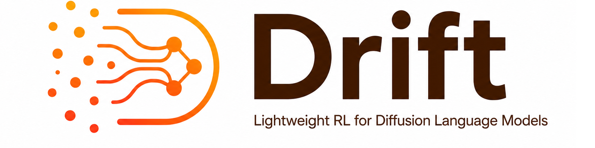

# Drift: <u>D</u>LM <u>R</u>e<u>i</u>n<u>f</u>orcement Learning <u>T</u>raining Framework <br>
Drift is an easy-to-use and extensible reinforcement learning framework for diffusion language models.
<p align="center">
  
</p>

## Features

- **Multi-model support** — Compatible with [LLaDA](https://github.com/ML-GSAI/LLaDA) and [Dream](https://github.com/HKUNLP/Dream) series models, with more diffusion LMs coming soon.
- **Flexible masking strategies** — Sequential masking, random masking, coupled random masking, and all masking, with configurable temperature-based sampling.
- **Accelerated rollout** — Block-wise parallel decoding with dynamic confidence thresholds for faster generation.
- **Diverse RLVR tasks** — Math, Code, Sudoku, and Countdown reward functions out of the box.

## Installation

```bash
conda create --name drift python=3.10
conda activate drift

pip install torch==2.6.0
pip install deepspeed==0.18.4
pip install --no-cache-dir \
  https://github.com/Dao-AILab/flash-attention/releases/download/v2.7.4.post1/flash_attn-2.7.4.post1+cu12torch2.6cxx11abiFALSE-cp310-cp310-linux_x86_64.whl
pip install -r requirements.txt
```

## Data Format

Training data should be placed in the `data/` directory as JSON files. The framework supports **math** (`MATH500`, `GSM8K`), **code** (`MBPP`, `HumanEval`), and **planning** (`sudoku`, `countdown`) tasks, and is easily extensible to custom tasks.

For detailed field specifications and examples of each data type, see [Data Format Specification](data/DATA_FORMAT.md).

## Training

Training is launched via [Accelerate](https://github.com/huggingface/accelerate) with DeepSpeed ZeRO-3. Configuration is managed through YAML files in `configs/`.

**Single-node training:**

```bash
accelerate launch trainer/main_rl.py config=configs/llada_code.yaml
```

**Config Examples:**

| Config | Model | Task |
|--------|-------|------|
| `llada_math.yaml` | LLaDA-8B | Math |
| `llada_code.yaml` | LLaDA-8B | Code |
| `dream_math.yaml` | Dream-7B | Math |
| `dream_code.yaml` | Dream-7B | Code |

**Multi-node training:**

For distributed training across multiple machines, set the standard environment variables and pass them to Accelerate:

```bash
# Run on each node:
accelerate launch \
  --num_machines=$WORLD_SIZE \
  --machine_rank=$RANK \
  --main_process_ip=$MASTER_ADDR \
  --main_process_port=$MASTER_PORT \
  --num_processes=$((WORLD_SIZE * 8)) \
  trainer/main_rl.py config=configs/llada_code.yaml
```

| Variable | Description |
|----------|-------------|
| `WORLD_SIZE` | Total number of nodes |
| `RANK` | Rank of the current node (0-indexed) |
| `MASTER_ADDR` | IP address of the rank-0 node |
| `MASTER_PORT` | Free port on the rank-0 node |


**Some training parameters** (set in YAML):

```yaml
training:
  mask_strategy: "sequential_masking"   # masking strategy
  reward_funcs: ["math"]               # reward function(s)

rollout:
  num_generations: 4                   # samples per prompt
  steps: 256                           # diffusion steps
  remasking_strategy: ["low_confidence_dynamic"] # denoising strategy
```

## Evaluation

Run evaluation on one or more checkpoints:

```bash
accelerate launch trainer/eval.py config=configs/eval/eval_llada_code.yaml
```

Evaluation configs are located in `configs/eval/` and support passing multiple checkpoint paths for batch evaluation.


## Acknowledgement

This framework builds upon [dLLM-RL](https://github.com/Wuyxin/dLLM-RL) and [fastdllm](https://github.com/zowaa/fastdllm), with its model foundations drawn from [Dream](https://github.com/HKUNLP/Dream) and [LLaDA](https://github.com/ML-GSAI/LLaDA). We gratefully acknowledge these teams for their valuable contributions to open-source research and development.
